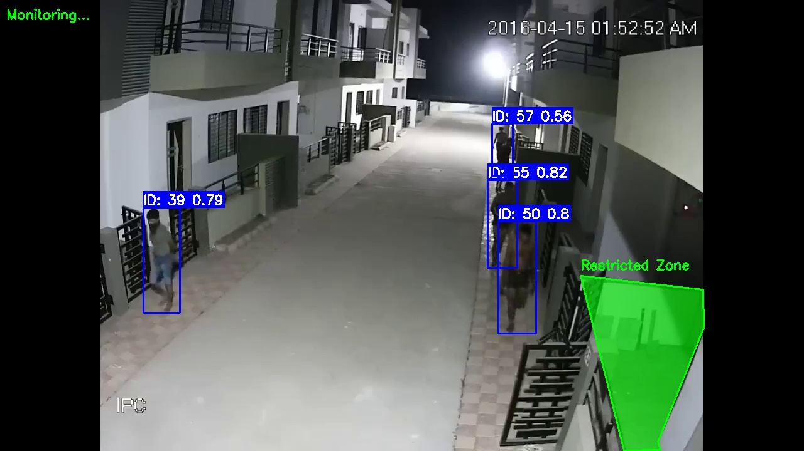
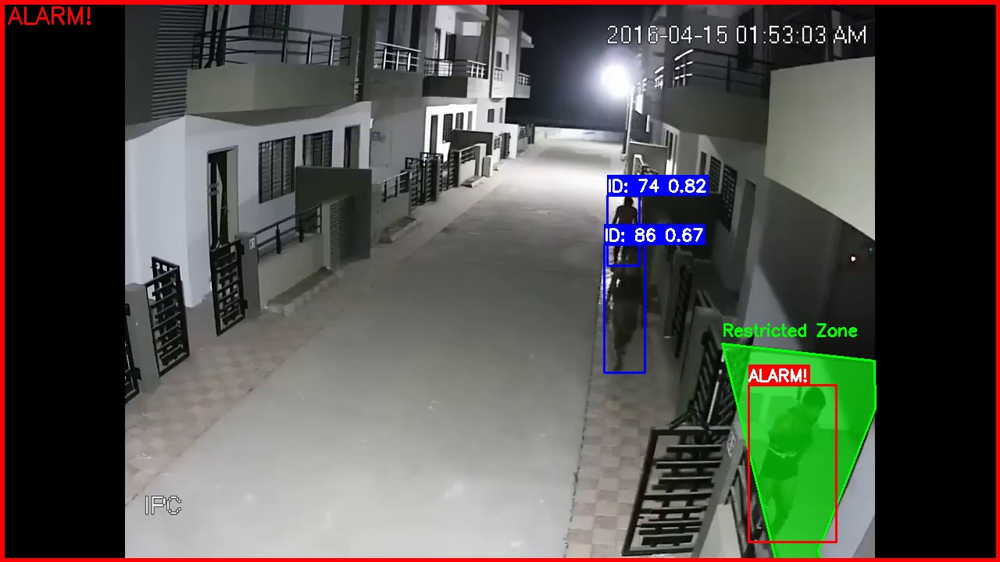
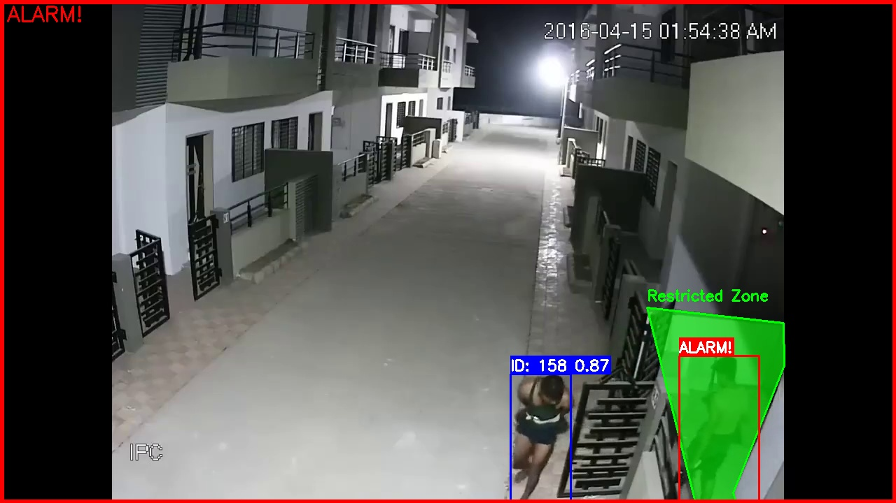
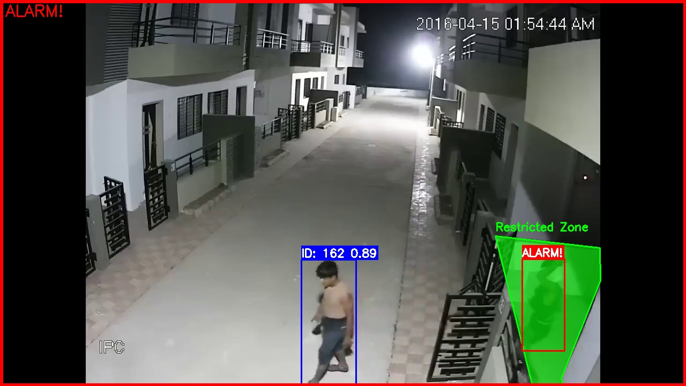

# 🚷  Restricted Zone Intrusion Detection System

## Система компьютерного зрения для автоматического обнаружения проникновений людей в запрещенные зоны с использованием YOLOv8 и DeepSORT

[](https://www.python.org/downloads/)
[](https://opencv.org/)
[](https://ultralytics.com/)
[](https://github.com/nwojke/deep_sort)

<p align="center">

</p>

## 🚀 Возможности

- **✅ Обнаружение людей** в реальном времени с помощью YOLOv8
- **✅ Отслеживание объектов** с уникальными ID через DeepSORT
- **✅ Интерактивная разметка** запрещенных зон поверх видео
- **✅ Сигнализация проникновений** с визуальными и текстовыми оповещениями
- **✅ re-ID** для стабильного трекинга при частичных пропаданиях
- **✅ Гибкая конфигурация** под различные сценарии использования

## 🎯 Алгоритм работы

1. Детекция объектов - YOLOv8 обнаруживает людей в кадре;
2. Трекинг - DeepSORT назначает уникальные ID и отслеживает траектории;
3. Проверка зон - реализация алгоритма "Ray Casting" для определения нахождения объектов (центров bbox) в запрещенных зонах;
4. Оповещение - визуальная сигнализация при проникновениях.

## 📸 Примеры работы

<p align="center">




</p>


## 🛠️ Установка

```bash
# Клонирование репозитория
git clone https://github.com/i-koskin/Restricted_Zone_Monitor.git
cd Restricted_Zone_Monitor
```
```bash
# Создание виртуального окружения
py -m venv venv
```
```bash
source venv/bin/activate  # Linux/MacOS
```
```bash
# или
venv\Scripts\activate  # Windows
```
```bash
# Установка зависимостей
pip install -r requirements.txt
```

## 📁 Структура проекта

Restricted_Zone_Monitor/

├── main.py                # Главный скрипт запуска

├── config.py              # Конфигурация параметров

├── zone_marker.py         # Интерактивная разметка зон

├── tracker.py             # Трекер с фильтрацией

├── alert_manager.py       # Менеджер оповещений

├── requirements.txt       # Зависимости проекта

├── restricted_zones.json  # Сохраненные зоны мониторинга

└── README.md              # Документация


## ⚙️ Конфигурация

### 1. Основные параметры (config.py)

#### Настройки модели YOLO
YOLO_MODEL = "yolov8m.pt"        # Доступные модели: n/s/m/l/x

CONFIDENCE_THRESHOLD = 0.7       # Порог уверенности детекции (0.1-0.9)

#### Параметры DeepSORT для трекинга
MAX_AGE = 30                     # Максимальное количество кадров, в течение которых трек может существовать без получения новой детекции (без ассоциации с объектом), прежде чем трек будет удалён

MIN_HITS = 5                     # Минимальное количество успешных ассоциаций (совпадений) детекции с треком, необходимое для подтверждения инициализации трека для объекта

MAX_COSINE_DISTANCE = 0.2        # Максимальное допустимое значение косинусного расстояния между вектором признаков обнаруженного объекта и центром (или репрезентативным вектором) существующего трека.

### 2. Формат файла зон restricted_zones.json

{
  "zones": [
    [
      [924, 440], [993, 719], [1051, 718], [1047, 705], [1120, 523], [1119, 462]
    ]
  ]
}


## 💻️ Использование

### 1. Разметка запрещенных зон:

```bash
python main.py --source test.mp4 --mark-zones
```
#### Инструкция по разметке:

ЛКМ - добавление точек зоны

ПКМ - завершение и сохранение разметки текущей зоны

c - очистка последней точки

d - удаление последней зоны

q или ESC - выход из режима разметки


### 2. Запуск мониторинга

```bash
# Использование видеофайла с сохранеием результата
python main.py --source test.mp4 --output output.avi
```

```bash
# Использование веб-камеры
python main.py --source 0
```

### 3. Управление во время работы:

q или Esc - выход из программы

p - пауза/продолжение

s - сохранение текущего кадра
